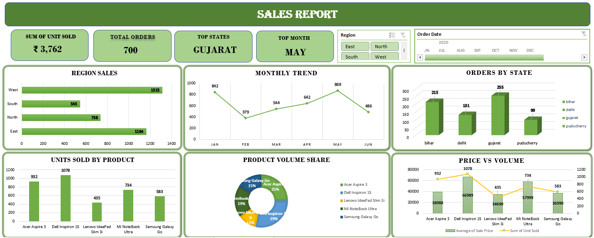

# 📊 Sales Report Dashboard

## 📌 Project Overview
The **Sales Report Dashboard** is an interactive Microsoft Excel dashboard developed to analyze sales performance across different regions, states, products, and time periods. It provides business users with a centralized view of key sales metrics through dynamic charts, KPI cards, and slicers, enabling quick and informed decision-making.

## 📷 Dashboard Preview

## 🎯 Business Objective
The objective of this dashboard is to:

- Monitor overall sales performance using key business metrics.
- Analyze sales across different regions and states.
- Track monthly sales trends.
- Compare product-wise sales volume and pricing.
- Identify top-performing products, regions, and months.
- Enable interactive filtering for deeper business analysis.

## 🛠️ Tools Used
- Microsoft Excel
- Pivot Tables
- Pivot Charts
- Slicers
- Conditional Formatting
- Excel Formulas
- Data Cleaning & Preparation

## 📊 Dashboard Features
- KPI cards displaying:
  - Total Units Sold
  - Total Orders
  - Top Performing State
  - Best Sales Month
- Region-wise sales analysis.
- Monthly sales trend visualization.
- State-wise order comparison.
- Product-wise units sold.
- Product volume share analysis.
- Price vs Units Sold comparison.
- Interactive Region and Date slicers for dynamic filtering.

## 📈 Key Insights
- **Gujarat** recorded the highest number of orders among all states.
- **May** was the best-performing month in terms of sales.
- **West** region generated the highest sales, followed by East.
- **Dell Inspiron 15** recorded the highest units sold among all products.
- **Lenovo IdeaPad Slim 3i** had the lowest sales volume, indicating lower customer demand.
- The dashboard allows quick identification of regional and product performance through interactive filters.

## 💡 Business Recommendations
- Increase inventory and marketing efforts for top-selling products such as **Dell Inspiron 15**.
- Study the reasons behind the lower sales of **Lenovo IdeaPad Slim 3i** and improve pricing or promotional strategies.
- Continue investing in high-performing regions while implementing targeted campaigns to improve sales in lower-performing regions.
- Use monthly sales trends to forecast future demand and optimize inventory planning.
- Regularly monitor KPIs to support data-driven business decisions.

## 📁 Files Included

| File | Description |
|------|-------------|
| `Sales_Report.xlsx` | Interactive Excel dashboard |
| `Dashboard_Overview.png` | Dashboard screenshot |
| `README.md` | Project documentation |

## 🎯 Skills Demonstrated
- Data Cleaning
- Data Analysis
- Dashboard Development
- KPI Reporting
- Excel Data Visualization
- Business Intelligence
- Data Storytelling
- Analytical Thinking

## 👩‍💻 Author

**Archana**

Aspiring Data Analyst passionate about Data Analytics, Business Intelligence, Data Visualization, and transforming raw data into actionable insights.
